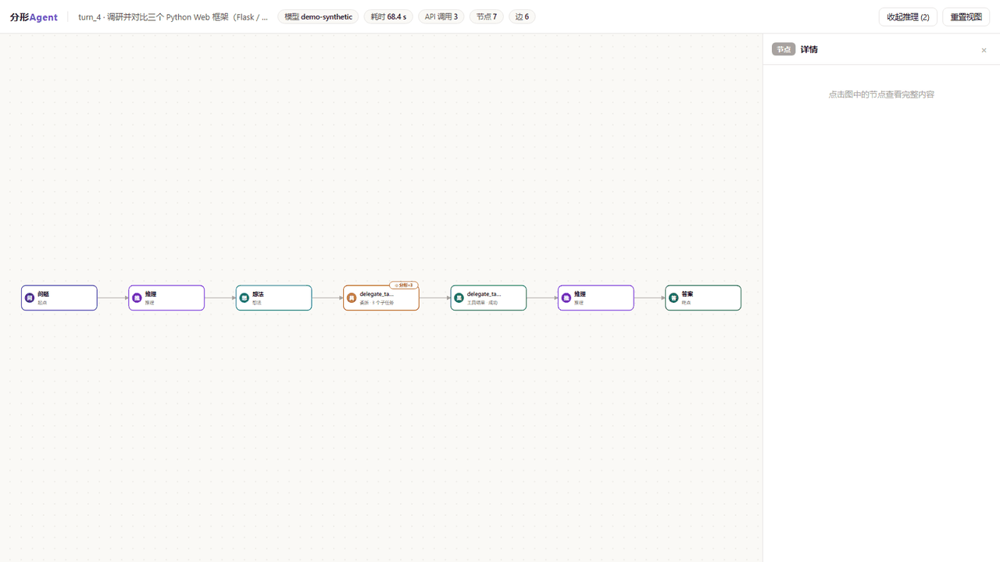
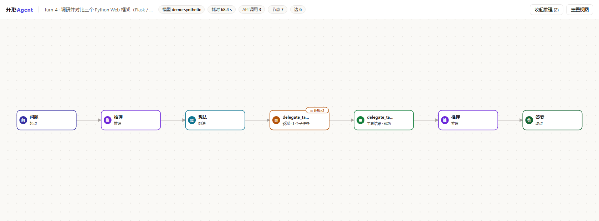
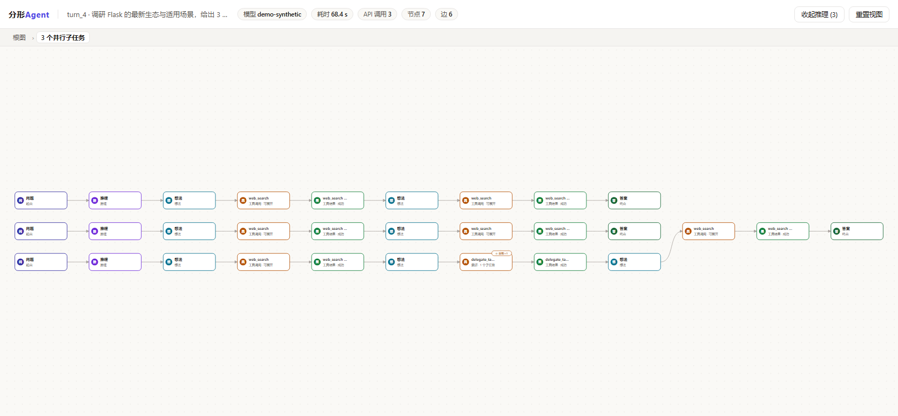
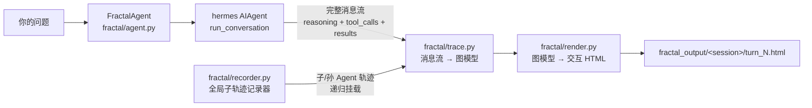

# 分形Agent · FractalAgent

> 每一次问答，都凝结成一张可以走进去的推理地图。

**分形Agent** 是一个基于 [hermes-agent](https://github.com/NousResearch/hermes-agent) 构建的个人 AI Agent。它与普通 Agent 的区别只有一件事，也是它的全部野心：

**每次与用户交互之后，它会把「从问题到答案」的完整推理过程——思考、决策、工具调用、子 Agent 委派——凝结成一张可视化、可交互的二维分形图。** 这张图永远从一个源点（你的问题）出发，走向唯一确定的终点（答案）；中间的网络形态，由推理真实发生的样子自由生长。

## 为什么叫「分形」

因为这张图是**自相似、可无限下钻**的：

- 主 Agent 的推理是一张图；
- 它委派出去的每个子 Agent，自己的推理过程也是一张同构的图，递归地挂在父图的工具节点上；
- 子 Agent 再委派的孙 Agent，亦然。

双击任何一个委派节点，你就「走进」了那个子 Agent 的大脑里——面包屑再带你一层层走回来。分形不是隐喻，是数据结构本身。

## 效果图

**13 秒交互演示：选中委派节点看参数 → 双击下钻三个并行子图 → 再下钻孙图 → 面包屑返回根图 → 收起推理节点**



**根图：问题 → 推理 → 想法 → 委派（⊕分形×3）→ 结果 → 推理 → 答案**



**双击委派节点下钻：三个并行子 Agent 的子图并列呈现——第三行子图内部还挂着自己的孙委派（⊕分形×1），递归可见**



## 特性

- 🌱 **源点 → 终点的硬保证**：每张图有且仅有一个入度为 0 的问题节点、一个出度为 0 的答案节点，全图双向可达（有自动化断言兜底）。
- 🕸️ **形态由数据决定**：纯问答是链，并行工具调用长出 branch/merge 的网，多步串行是 workflow——不做任何人工布局假设。
- 🔀 **真实的分形展开**：通过全局轨迹记录器捕获 `delegate_task` 子 Agent（含后台异步委派）的完整消息流，递归构图为子图、孙图，双击节点就地展开。
- ⏳ **异步感知**：顶层委派在 hermes 中默认后台执行，子任务未完成时节点呈现 `⏳ 运行中` pending 态；完成后 `/graph` 一键刷新，子图自动挂上。
- 🎛️ **探索式交互**：滚轮缩放、拖拽平移、点击节点查看完整内容（推理全文 / 工具参数 / 工具结果）、祖先路径高亮、一键收起推理节点。
- 🧩 **对上游零侵入**：分形层是一个独立外挂包，**不修改 hermes 核心的一行代码**，上游可以独立演进。
- 📦 **单文件离线产物**：每张图是一个自包含 HTML（内嵌 SVG + JS，零 CDN 依赖），可以直接发给任何人。

## 快速开始

### 无需 API Key：先看演示

```bash
python fenxing.py --demo
# 然后浏览器打开：
#   fractal_output/demo/turn_4.html   ← 分形嵌套演示（3 子图 + 1 孙图）
#   fractal_output/demo/turn_2.html   ← 并行工具网络
```

### 真实运行

1. 安装 hermes 依赖（参见上游仓库的 `pyproject.toml`，推荐虚拟环境）：

   ```bash
   pip install -e .
   ```

2. 配置模型凭证（与 hermes 完全一致）：

   ```bash
   # ~/.hermes/.env —— 只放密钥
   OPENROUTER_API_KEY=sk-or-...
   ```

3. 启动：

   ```bash
   python fenxing.py                    # 交互问答，每轮自动产图
   python fenxing.py --model anthropic/claude-sonnet-4.6
   python fenxing.py --toolsets web,terminal
   ```

REPL 内命令：

| 命令 | 作用 |
|---|---|
| `/graph` | 重新渲染上一轮的分形图（后台子任务完成后用它把子图挂上） |
| `/demo` | 生成合成演示图 |
| `/help` · `/quit` | 帮助 · 退出 |

## 它是怎么工作的



关键设计：hermes 的 `AIAgent.run_conversation()` 返回的 `messages` 里本来就装着推理过程的全部原料（assistant 消息的 `reasoning`、`tool_calls`，以及 `tool` 消息的结果）。分形层只是把这些原料**结构化**——不改核心，只读产出。

子 Agent 轨迹的捕获同理：hermes 里每个子 Agent 本身就是一个 `AIAgent` 实例，都走同一个 `run_conversation` 入口。分形层在该入口装了一个幂等、fail-open 的记录器，按 goal 把子轨迹匹配回父图的 `delegate_task` 节点，递归成图。

### 图模型

| 节点 kind | 含义 | 颜色 |
|---|---|---|
| `question` | 源点：用户的问题（唯一，入度 0） | 深靛蓝 |
| `reasoning` | 模型的推理内容 | 紫 |
| `thought` | 中间想法 / 决策 | 青 |
| `tool_call` | 工具调用（委派类工具可分形展开） | 琥珀 |
| `tool_result` | 工具结果（ok / error） | 绿 / 红 |
| `answer` | 终点：最终回答（唯一，出度 0） | 深绿 |

边有三种：`flow`（主流水）、`branch`（并行工具调用的分叉）、`merge`（并行结果的汇合）。

## 目录结构（分形层）

```
fractal/
├── trace.py       # 消息流 → 图模型（递归构图，深度上限兜底）
├── recorder.py    # AIAgent.run_conversation 全局记录器（线程安全 / fail-open）
├── render.py      # 图模型 → 单文件交互 HTML（钻取 / 面包屑 / 缩放 / 详情）
├── agent.py       # FractalAgent：包装 hermes AIAgent，每轮自动产图
├── demo.py        # 5 组合成演示（链 / 网 / workflow / 分形嵌套 / pending）
└── selfcheck.py   # 图结构断言（源汇唯一、双向可达、嵌套合法、离线自包含）
fenxing.py         # 入口 REPL
fractal_output/    # 生成的分形图（demo/ 为演示产物）
```

## 路线图

- [x] 消息流 → 分形图（链 / 网 / workflow）
- [x] 子 Agent 轨迹递归挂载 + 双击下钻 + 面包屑
- [x] 后台异步委派的 pending 态与 `/graph` 刷新
- [ ] 真实环境端到端实测（需完整 hermes 依赖与 API Key）
- [ ] 时间轴播放：按真实发生顺序逐节点点亮推理路径
- [ ] 更多委派形态（orchestrator 扇出）的并行视图优化
- [ ] 与 hermes TUI / Gateway 的深度集成

## 致谢与许可

本项目是 [hermes-agent](https://github.com/NousResearch/hermes-agent)（© Nous Research，MIT License）的衍生作品。上游开发指南见 [AGENTS.md](AGENTS.md)，上游 README 见 [README.hermes.md](README.hermes.md)。分形层遵循同样的 [MIT License](LICENSE)。
